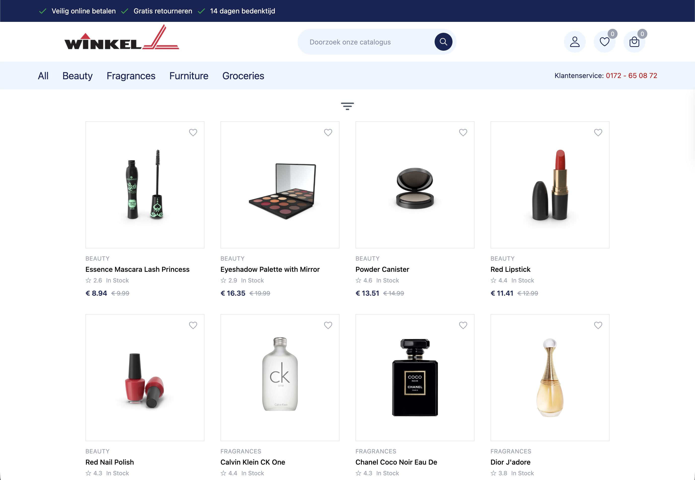
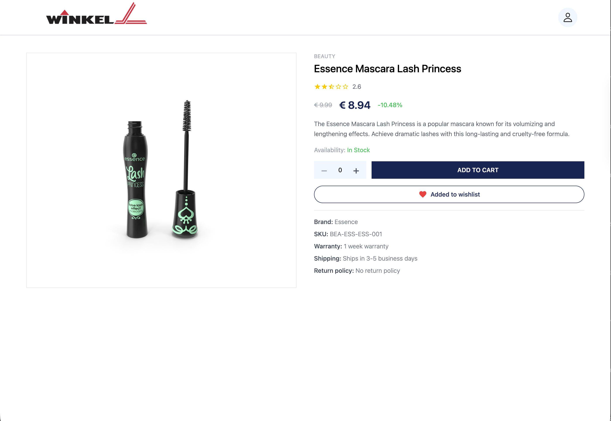
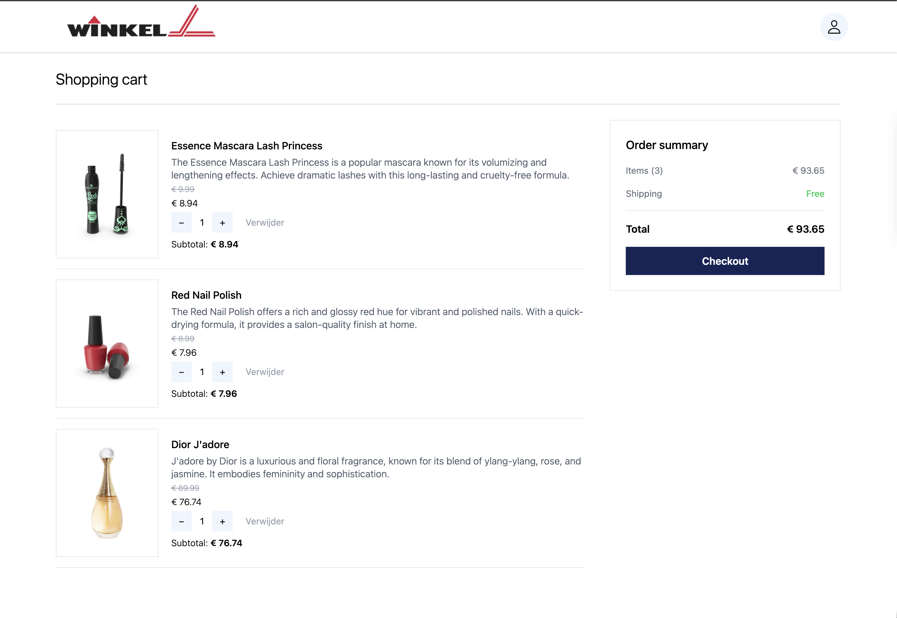
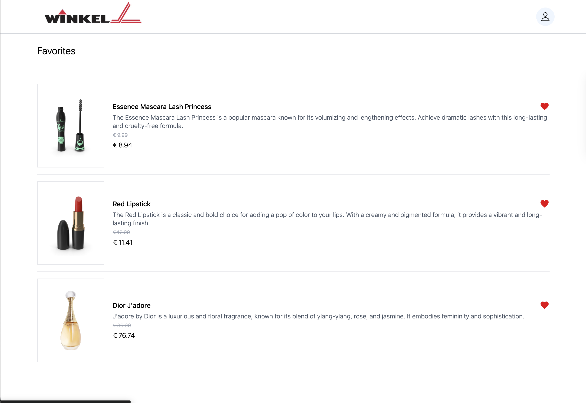
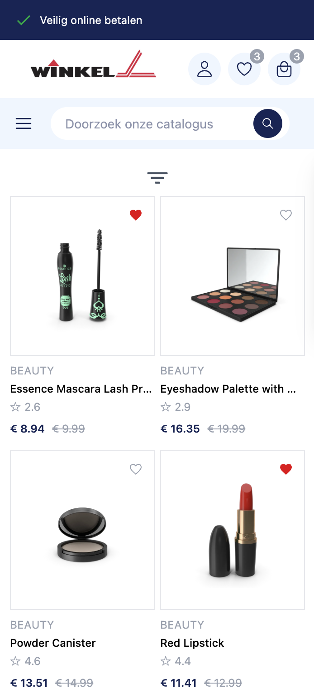

# 🛒 Winkel — Full-Stack E-Commerce App

A fully functional e-commerce web application built as a portfolio project, demonstrating full-stack development with React, TypeScript, Node.js, Express, and PostgreSQL.

**Live demo:** [https://e-commerce-1-60xw.onrender.com](https://e-commerce-1-60xw.onrender.com)

---

## Screenshots

### Homepage


### Product detail


### Shopping cart


### Favorites


### Mobile


---

## Features

- Browse 100+ products across multiple categories (Beauty, Fragrances, Furniture, Groceries)
- Filter by price range, rating, and category
- Full-text product search
- Product detail page with star ratings, availability, and discount pricing
- Add to cart with quantity control
- Favorites / wishlist with persistence per user
- User registration and login
- Cart and favorites synced to database per user
- Responsive design — works on mobile, tablet, and desktop

---

## Tech Stack

### Frontend
- React 18
- TypeScript
- Tailwind CSS
- React Router
- Context API (AuthContext, ProductContext)
- Vite

### Backend
- Node.js
- Express
- PostgreSQL
- REST API

### Deployment
- Frontend: Render Static Site
- Backend: Render Web Service
- Database: Render PostgreSQL
- Version control: GitLab

---

## Architecture

The app uses a **monorepo structure** with a separate `server` folder for the backend:

```
e-commerce/
├── src/                  # React frontend
│   ├── components/       # Reusable UI components
│   ├── context/          # AuthContext, ProductContext
│   ├── paginas/          # Page components (Cart, Favorites, Product, Register)
│   └── data/             # TypeScript types
├── server/               # Node.js backend
│   ├── index.js          # Express server + routes
│   └── db.js             # PostgreSQL connection
└── public/               # Static assets
```

State management is handled entirely through React Context API — no external state library needed.

---

## Database Schema

```sql
CREATE TABLE users (
    id SERIAL PRIMARY KEY,
    first_name VARCHAR(100),
    last_name VARCHAR(100),
    email VARCHAR(100) UNIQUE,
    password VARCHAR(255),
    phone VARCHAR(20),
    created_at TIMESTAMP DEFAULT NOW()
);

CREATE TABLE cart (
    user_id INTEGER,
    product_id INTEGER,
    quantity INTEGER,
    PRIMARY KEY (user_id, product_id)
);

CREATE TABLE favorites (
    id SERIAL PRIMARY KEY,
    user_id INTEGER,
    product_id INTEGER,
    UNIQUE (user_id, product_id)
);
```

---

## Getting Started

### Prerequisites
- Node.js
- PostgreSQL

### Installation

```bash
# Clone the repository
git clone https://gitlab.com/arnedo1-group/e-commerce.git
cd e-commerce

# Install frontend dependencies
npm install

# Install backend dependencies
cd server
npm install
```

### Environment variables

Create `server/.env`:

```
DB_HOST=localhost
DB_PORT=5432
DB_NAME=e_commerce
DB_USER=your_user
DB_PASSWORD=your_password
```

Create `.env` in the root:

```
VITE_API_URL=http://localhost:3000
```

### Run locally

```bash
# Start backend (from /server)
node index.js

# Start frontend (from root)
npm run dev
```

---

## Notes

This is a portfolio project built for learning purposes. No real orders are processed and no payment information is collected. Product data is sourced from [DummyJSON](https://dummyjson.com).

---

## Author

**Jose Arnedo**  
Bachelor Informatica student (Open Universiteit Nederland) | React · TypeScript · Node.js · PostgreSQL
[GitLab](https://gitlab.com/arnedo1-group)